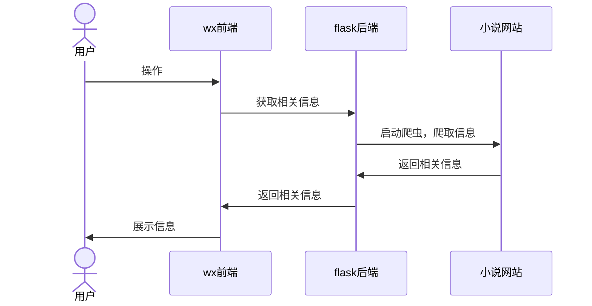
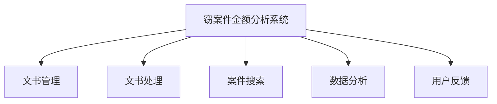

# 学校期间的项目
毕业4年了，回想一下，本科上学那会做的项目其实也不算少了，当时不懂用 `git`，
没有上传代码保存云端，基本都丢失了，现在想想，还是觉得好可惜。

仍有点印象的就有：
- 图书管理系统：java实现命令行操作指令执行
- 词频统计工具：c++通过构造词频树，实现树的遍历查找等操作
- 校友网站：C#，asp.net，三层架构，使用mysql实现的web应用
- 表达式计算器程序：c++通过编译原理的词法分析和语法分析，收集表达式进行计算的桌面应用程序。
- 笔记app：简单的安卓应用程序，主要作用是属性组件的用法
- 小说阅读微信小程序：使用python爬虫技术对盗版小说网站进行数据爬取，再将数据返回给微信小程序前端
- 智慧法院盗窃案件金额分析系统：python爬虫对裁判文书网爬取文书，数据库存储数据；数
  据用LSTM和朴素贝叶斯模型训练，再使用训练好的模型处理数据，最后采用vue+ echarts分析展示

## 微信小程序——小说阅读

### 项目介绍：
使用前后端分离，flask + wxml。使用爬虫技术对盗版小说网站进行数据爬取解决小说内容数据来源问题，flask实时
响应微信小程序前端请求。

### 流程图

### 详细步骤说明
#### 1. 爬虫
使用python的requests库，对小说网站进行爬取，获取小说内容，直接往上层返回。
#### 2. flask后端
使用flask框架，实时响应微信小程序前端请求，将爬取到的小说内容返回给前端。
#### 3. wx前端
使用微信小程序框架，展示小说内容，并实现翻页功能、自动下一章、收藏等功能。

## 智慧法院盗窃案件金额分析系统

### 项目介绍：
涉及到数据来源、数据存储、数据处理，数据分析和展示。python爬虫对裁判文书网爬取文书，数据库存储数据；数
据用 `LSTM` 和 `朴素贝叶斯` 模型训练，再使用训练好的模型处理数据，最后采用`vue + echarts`分析展示.

### 流程图

