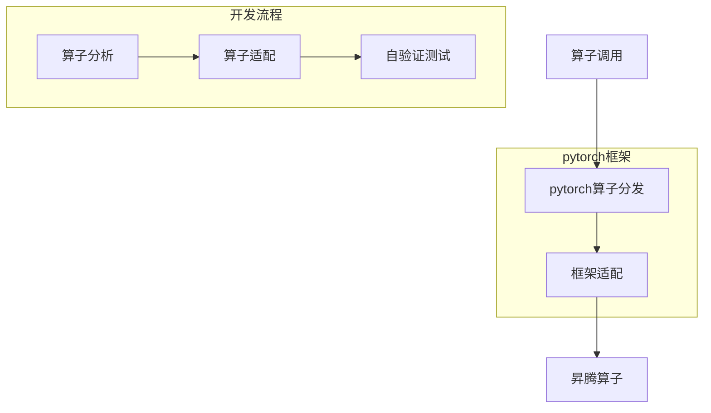

# 工作后的项目
校招后入职开始算，工作4年了，一直在在做昇腾的项目，目前就要离开了，记录一下。

具体有：
- pytorch框架算子适配：适配pytorch框架，实现昇腾的算子。
- RetinaNet模型适配：模型迁移适配，RetinaNet模型在昇腾芯片上精度性能与GPU对齐。
- 算子api泛化自动化：自动生成算子调用的脚本，实现自动化测试。
- MindX DL平台：基于k8s和昇腾芯片的一站式深度学习平台
  - api-gatewawy: 平台请求统一鉴权和分发
  - cluster-manager: 集群管理，提供集群信息和集群内各组件的证书管理
  - user-manager: 支持角色和用户管理，包括用户鉴权
  - data-manager: 支持文件和文件家操作，管理挂载存储下的用户数据
  - image-manager: 镜像管理，基于harbor镜像仓
  - alarm-manager: 告警管理，基于alertmanager
  - dataset-manager: 数据集管理，支持数据集创建、删除、浏览等操作
  - label-manager: 标注管理，支持标注任务管理，基于label-studio
  - model-manager: 支持模型评估认为管理、模型转换、模型版本管理
  - inference-manager: 支持推理任务管理、 包括在线推理和批量推理
  - train-manager: 支持训练任务管理，训练可视化任务管理和开发环境管理
  - 监控运维：基于`loki`、`prometheus`和`grafana`
- DL组件：昇腾芯片适配k8s的基础组件
  
  - [ascend-device-plugin](https://gitee.com/ascend/ascend-device-plugin.git)
  - [npu-exporter](https://gitee.com/ascend/ascend-npu-exporter.git)
  - [ascend-docker-runtime](https://gitee.com/ascend/ascend-docker-runtime.git)

- 其他项目：
  - 基站设备巡检自动化工具
  - kube-edge智能终端云边设备适配
  - 能源项目--充电网络控制器协议开发
  - 
## pytorch框架算子适配

### 项目介绍：
对 pytorch 开源框架进行二次开发，适配 pytorch 算子使其支持使用 npu 计算。需要对 pytorch 源码有一定的了解。

### 流程图

### 项目地址
[pytorch框架算子适配](https://gitee.com/ascend/pytorch-develop.git)

## RetinaNet模型适配

### 项目介绍：
将现有的 `pytorch` 深度学习模型 `MMCV下的RetinaNet` 修改适配到 `NPU` 也能使用，且精度和性能需要达标。

### 开发流程
1. 下载原开源模型代码
2. 在`cpu/gpu`上跑通模型
3. 将模型相关参数转移到`npu`,并修改模型代码使其能在`npu`上运行
4. 对比`gpu`场景下的精度和性能

### 项目地址
[RetinaNet模型适配](https://gitee.com/ao-jiangdong/modelzoo.git)

## 算子api泛化自动化
### 项目介绍：
针对 PyTorch 算子数量庞大，为提高算子适配测试的效率，决定采用自动化工具进行处理。基于海思 Xrun 测试框架，设计并实现
自动化解决方案。主要负责算子调用脚本自动生成模块。

### 开发流程
1. 了解海思 Xrun 测试框架执行流程
2. 熟悉需求IPO, 开发代码生产脚本
3. 集成到框架中进行验证测试

### MindX DL平台
### 项目介绍：
DL平台是一个一站式AI模型开发服务，专门为科研院校和实验室提供快速搭建基于NPU服务器的深度学习环境。平台涵盖了数据
管理、模型开发、训练、管理和部署等全套端到端流程功能，旨在帮助客户高效地进行AI模型开发。整个项目基于docker和k8s框
架进行构建。